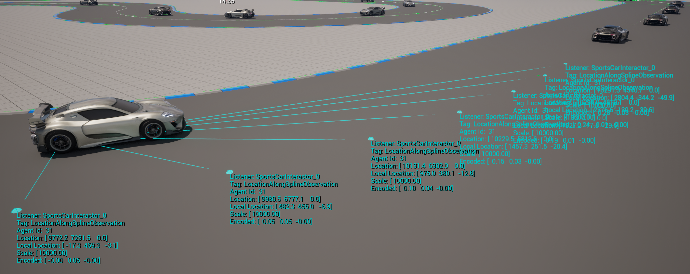

# Reinforcement Learning Car Simulation

Welcome to the Reinforcement Learning Car Simulation project! This repository contains an autonomous car simulation built using reinforcement learning (RL) and imitation learning techniques in Unreal Engine with PyTorch.

## Table of Contents
- [Project Overview](#project-overview)
- [Features](#features)
- [Screenshots](#screenshots)
- [Video Demo](#video-demo)
- [Installation](#installation)
- [Usage](#usage)
- [Contributing](#contributing)
- [License](#license)
- [Contact](#contact)

## Project Overview

This project implements an autonomous car simulation that learns to drive around a circuit by:
- **Reinforcement Learning (RL):** Learning from trial and error using rewards.
- **Imitation Learning:** Mimicking human driving behaviors recorded during manual sessions.

### Key Observation Methods:
1. **Median-based Observation:** Uses projections onto the circuit's median to determine the car's direction and positioning.
2. **Wall-based Observation:** Employs raycasts to measure the distance from surrounding walls.

The project integrates TensorBoard to visualize training metrics, such as loss over time, to monitor performance improvements.

## Features

- **Dual Learning Approaches:** Compare and contrast RL and imitation learning methodologies.
- **Unreal Engine Integration:** Realistic simulation environment.
- **TensorBoard Visualization:** Real-time insights into model performance.
- **Customizable Observations:** Switch between median-based and wall-based observations.

## Screenshots

Below are some screenshots of the simulation in action. Replace the placeholder image paths with your actual screenshot files.


*Figure 1: The car navigating the circuit using median-based observation.*


*Figure 2: Wall-based observation in action with raycast visualizations.*

## Video Demo

Watch the demo video of the simulation in action:

[](https://www.youtube.com/watch?v=your-video-id)
*Click the image above to view the video on YouTube.*

Alternatively, you can directly visit the video [here](https://www.youtube.com/watch?v=your-video-id).

## Installation

Follow these steps to set up the project locally:

1. **Clone the repository:**
    ```bash
    git clone https://github.com/yourusername/reinforcement-learning-car-simulation.git
    cd reinforcement-learning-car-simulation
    ```

2. **Set up a virtual environment (optional but recommended):**
    ```bash
    python -m venv venv
    source venv/bin/activate  # On Windows, use `venv\Scripts\activate`
    ```

3. **Install the required dependencies:**
    ```bash
    pip install -r requirements.txt
    ```

4. **Configure Unreal Engine:**
    - Follow the instructions in the `docs/UnrealEngineSetup.md` file for setting up the simulation environment.

## Usage

### Training the Model
To start training your model using RL, run:

```bash
python train_rl.py --config configs/rl_config.yaml
